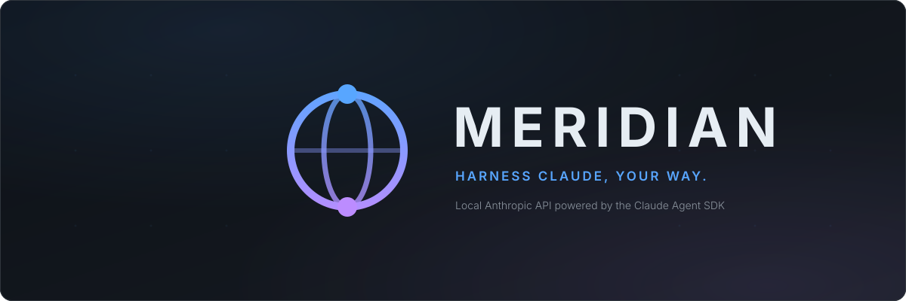
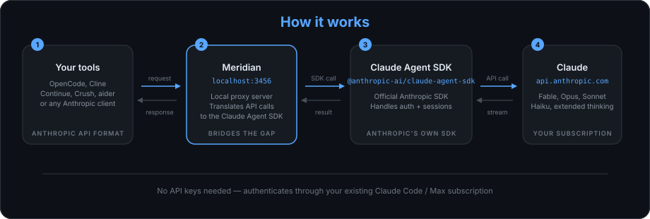

<p align="center">
  
</p>

<p align="center">
  <a href="https://github.com/rynfar/meridian/releases"></a>
  <a href="https://www.npmjs.com/package/@rynfar/meridian"></a>
  <a href="#"></a>
  <a href="#"></a>
  <a href="https://discord.gg/jP2a2Z92NZ"></a>
</p>


Meridian runs a local API for Claude-powered coding agents and chat clients. It translates Anthropic Messages, OpenAI Chat Completions, and OpenAI Responses requests into Claude Agent SDK calls, with session routing, tool forwarding, and usage diagnostics.

Use your existing Claude login or configure a separate [authentication profile](docs/profiles.md). Model access, usage limits, and billing remain controlled by Anthropic. See its [Agent SDK plan guidance](https://support.claude.com/en/articles/15036540-use-the-claude-agent-sdk-with-your-claude-plan) for current subscription rules.

## Quick Start

Requires **Node.js 22 or newer** and an authenticated Claude Code installation (`claude` on your PATH). Bun is needed for development, not to run the published npm package.

```bash
npm install -g @rynfar/meridian
claude login
meridian
```

Meridian listens at `http://127.0.0.1:3456`. Open that address for account status and usage, or `/telemetry` for requests, logs, and cache health.

For **OpenCode V1**, run setup once, then launch OpenCode in another terminal:

```bash
meridian setup
ANTHROPIC_API_KEY=x ANTHROPIC_BASE_URL=http://127.0.0.1:3456 opencode
```

OpenCode V2 requires a [supported pinned beta and V2 setup](docs/agents.md#opencode-v2-beta). Other clients have their own [setup instructions](docs/agents.md).

`x` is a placeholder only when proxy authentication is disabled. If you set `MERIDIAN_API_KEY`, use that secret in your clients. Keep the default loopback binding for local use; see [authentication](docs/configuration.md#api-key-authentication) before exposing the proxy to a network.

## What Meridian Provides

- **Three API formats:** Anthropic `/v1/messages`, OpenAI `/v1/chat/completions`, and `/v1/responses`, plus model discovery at `/v1/models`.
- **Conversation continuity:** SDK session resume, compaction and undo handling, restart persistence, and concurrent request coordination for clients with stable session identities.
- **Client-owned tools:** passthrough adapters return tool calls for the connecting agent to execute. Internal-mode adapters can use SDK tools on the proxy host.
- **Multiple accounts:** active-profile selection, sticky routing, and optional priority failover.
- **Observability:** request metrics, diagnostic logs, cache anomaly detection, envelope audits, API-equivalent cost estimates, and Prometheus metrics. SQLite history is opt-in.
- **Configuration:** per-adapter prompts and thinking, adapter instances, and composable plugins.

<p align="center">
  
</p>

## Documentation

| Guide | What you can do |
|-------|-----------------|
| [Agent setup](docs/agents.md) | Connect OpenCode, Crush, Droid, Cline, Aider, Codex, Open WebUI, Continue, Cherry Studio, ForgeCode, Pi, Prime Agent, Claude Code, Jcode, Polytoken, and Hermes |
| [Configuration](docs/configuration.md) | Set environment variables, authenticate clients, inspect endpoints, tune SDK features, and troubleshoot tool calls |
| [Profiles](docs/profiles.md) | Add accounts, log in headlessly, and configure sticky or priority routing |
| [Deployment](docs/deployment.md) | Install with Nix, run a Home Manager service, or build and run Docker |
| [Plugins](docs/plugins.md) | Install and manage plugins; follow the linked authoring guide to write one |
| [Monitoring](MONITORING.md) | Find usage limits, read token and cache metrics, and investigate failures |
| [Development](docs/development.md) | Work from source, validate changes, and embed the proxy |
| [Architecture](ARCHITECTURE.md) | Understand module boundaries and session design |

## Client Compatibility

The table records existing verification, **not a fresh certification of every current client release or platform**. Version-specific evidence and limitations are in the [agent guide](docs/agents.md) and [E2E procedures](E2E.md). Updating these docs does not rerun live model tests.

| Agent | Status | Notes |
|-------|--------|-------|
| [OpenCode](https://github.com/anomalyco/opencode) | Previously verified | V1 and pinned V2 beta support; requires the matching `meridian setup` mode ([setup](docs/agents.md#opencode)) — tools, durable resume, restart, undo, compaction, parallel subagents |
| [ForgeCode](https://forgecode.dev) | Previously verified | Provider config (see [Agent Setup](docs/agents.md)) — passthrough tool execution, session resume, streaming |
| [Droid (Factory AI)](https://factory.ai/product/ide) | Previously verified | BYOK config (see [Agent Setup](docs/agents.md)) — full tool support, session resume, streaming |
| [Crush](https://github.com/charmbracelet/crush) | Previously verified | Provider config (see [Agent Setup](docs/agents.md)) — full tool support, session resume, headless `crush run` |
| [Cline](https://github.com/cline/cline) | Previously verified | Config (see [Agent Setup](docs/agents.md)) — full tool support, file read/write/edit, bash, session resume |
| [Aider](https://github.com/paul-gauthier/aider) | Previously verified | Env vars — file editing, streaming; historical `--no-stream` limitation; see setup guide |
| [Open WebUI](https://github.com/open-webui/open-webui) | Previously verified | OpenAI-compatible endpoints — set base URL to `http://127.0.0.1:3456/v1` |
| [Pi](https://github.com/mariozechner/pi-coding-agent) | Previously verified | models.json config (see [Agent Setup](docs/agents.md)) — full tool support via passthrough; detected via `x-meridian-agent: pi` header |
| [Prime Agent](https://www.npmjs.com/package/prime-agent) | Limited verification | Extension config (see [Agent Setup](docs/agents.md)) — reliable with one active agent. Concurrent RLM subagents receive distinct session keys, but are not yet production-safe; see [Prime Agent limitations](docs/agents.md#prime-agent). The extension's `metadata.user_id` stamp is **required**, not optional. |
| [Claude Code](https://docs.anthropic.com/en/docs/claude-code) | Previously verified | `ANTHROPIC_BASE_URL` — remote clients share a Max subscription over the network; client CWD preserved in system prompt |
| [Cherry Studio](https://github.com/CherryHQ/cherry-studio) | Previously verified | `cherry` adapter (see [Agent Setup](docs/agents.md)) — chat client with Claude's built-in web search via internal mode |
| [Polytoken](https://polytoken.dev/) | Previously verified | Provider config (see [Agent Setup](docs/agents.md#polytoken)) — `X-Polytoken-Session` identity, mandatory client-owned tools (passthrough cannot be disabled), signed-thinking passthrough |
| Jcode | Previously verified | `/v1/chat/completions` + `x-jcode-session` header — dedicated `jcode` adapter keeps append-only history intact, so retained sessions resume on one SDK session (historical two-turn Opus cache test) |
| [Codex CLI](https://github.com/openai/codex) | Previously verified | `/v1/responses` (see [Agent Setup](docs/agents.md)) — Responses-API provider, passthrough tool execution; verified on 0.144 (plain + tool-driving turns) |
| [Continue](https://github.com/continuedev/continue) | Untested | OpenAI-compatible endpoints should work — set `apiBase` to `http://127.0.0.1:3456/v1` |


## Important Limits

- API compatibility is a supported subset. Native Anthropic server tools such as `web_search_*` are rejected; use an API provider for those calls. OpenAI images require data URLs.
- `max_tokens` is ignored by default. Opt in with `MERIDIAN_ENFORCE_MAX_TOKENS=1`; see [output limits and other constraints](docs/configuration.md#known-limitations).
- Prompt cache hits and session reuse depend on stable client identity, history, model, account, and upstream cache availability. They are not guaranteed.
- Prime Agent concurrent RLM orchestration is not production-safe. Use one active agent for unattended or usage-sensitive work; see [evidence and limitations](docs/agents.md#prime-agent).
- Meridian's context defaults are model-specific. Check [model configuration](docs/configuration.md#configuration) and your account's entitlement rather than assuming every primary request receives 1M context.

## FAQ

**Does using the SDK guarantee subscription access?**
No. Meridian uses the SDK for model calls, but that does not guarantee eligibility, uninterrupted access, or a particular billing treatment. Anthropic's [current plan guidance](https://support.claude.com/en/articles/15036540-use-the-claude-agent-sdk-with-your-claude-plan) governs subscription use. API-key profiles use their configured API billing.

**Where are my usage limits and logs?**
Start at `/` for account usage and `/telemetry` for request metrics and diagnostic logs. [Monitoring](MONITORING.md) explains quota windows, cache alerts, persistence, and estimated cost.

**What if authentication expires?**
Meridian attempts refresh for refreshable OAuth credentials. Run `meridian refresh-token` to request a refresh, or log in again with `claude login` / `meridian profile login <name>`. Long-lived token profiles need a replacement token when they expire.

**What if I get “You're out of extra usage”?**
Check account quota and billing first, then the [context settings](docs/configuration.md#configuration). Historical prompt-specific workarounds are documented under [plugins](docs/plugins.md#official-plugins); they are not a guarantee of billing eligibility.

**Why does health say the OpenCode plugin is not configured?**
Run the matching `meridian setup` command and restart OpenCode. This status concerns the OpenCode integration; other clients do not need that plugin.

## Contributing

Issues and PRs are welcome. See [development](docs/development.md), [coding guidelines](AGENTS.md), [design](DESIGN.md), and [E2E verification](E2E.md). Join the [Discord](https://discord.gg/jP2a2Z92NZ) to discuss ideas.

## License

MIT
